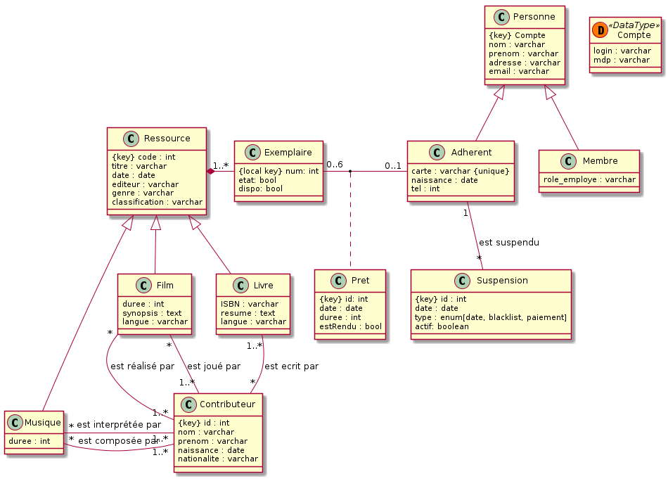

# nf18_projet

## auteurs

 - Elise Maistre
 - Pierre Adorni
 - Robin Dereux
 - Gauthier Roy

## sujet

**Biblio** : 
<u> Système de gestion d'une bibliothèque </u>

Projet de gestion d'une bibliotèque en python et SQL : définition du besoin, conception de la base de données et gestion en python.  
Projet réalisé dans le cadre de l'UV NF18, en groupe de 4.  
**Durée** : de septembre à décembre 2021

## UML

